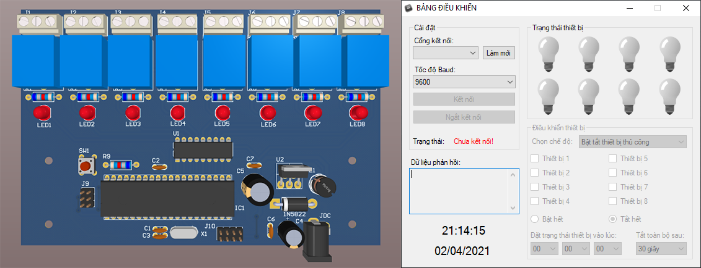

# Điều khiển thiết bị với Winform
*Điều khiển thiết bị với Winform được phát triển dựa trên ATMega16 và C# Winform*

### Giới thiệu
Ứng dụng nhỏ cho phép bạn điều khiển 8 thiết bị thông qua cổng COM trên máy tính với ứng dụng Winform.

### Tính năng
- Điều khiển thủ công các thiết bị có phản hồi
- Có chức năng hẹn giờ tắt các thiết bị

### Thông số kỹ thuật
- Điện áp: 9VDC đến 12VDC
- Đển kết nối với máy tính cần có thêm module chuyển đổi USB sang UART

